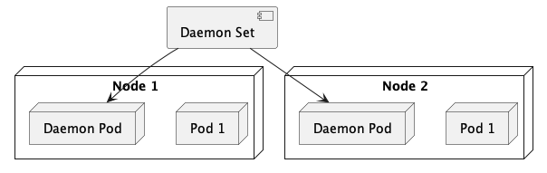

Daemont Set akan membuat pod sebanyak dengan node nya



## Membuat Daemon Set
```bash
kubectl create -f nginx-daemon-set.yaml
```

## Check Daemon Set
```bash
kubectl get daemonset
```

## Delete Daemon Set
```bash
kubectl delete daemonset daemon-nginx
```