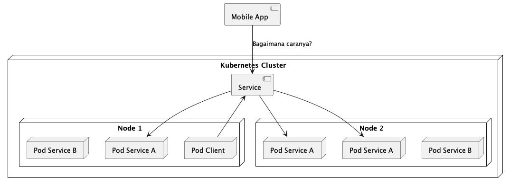

Kadang ada kebutuhan kita perlu untuk mengekspos service keluar, contoh nya mobile app yang di install di local HP
Tujuannya adalah agar aplikasi dari luar kubernetes cluster bisa mengakses Pod yang berada di belakang service tersebut

## Tipe Service
- ClusterIP: Mengekpos Service di dalam internal kubernetes cluster
- ExternalName: Memetakan Service ke externalName (misalnya: example.com)
- NodePort: Mengekspos Service pada setiap IP node dan port yang sama. Kita dapat mengakses Service dengan tipe ini, dari luar cluster - melalui <NodeIP>:<NodePort>.
- LoadBalancer: Mengekspos Service secara eksternal dengan menggunakan LoadBalancer yang disediakan oleh penyedia layanan cloud.

## Mengekpose Service
- Dengan menggunakan NodePort, sehingga Node akan membuka port yang akan meneruskan request ke Service yang dituju.
- Dengan menggunakan LoadBalancer, sehingga Service bisa diakses via LoadBalancer, dan LoadBalancer akan meneruskan request ke NodePort dan dilanjutkan ke Service
- Menggunakan Ingress, dimana Ingress adalah resource yang memang ditujukan untuk mengekspos Service. Namun Ingress hanya beroperasi di level HTTP
