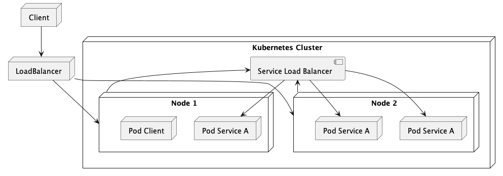

Load Balancer akan meneruskan request ke beberapa node secara balanced

Jalankan Service
```bash
kubectl create -f service-nginx-load-balancer.yaml
kubectl get all
# Maka kita bisa liat External IP nya pending
```

Testing di Minikube
```bash
minikube tunnel

# Buka Terminal kedua
# Maka External IP tidak akan lagi ber status
# pending

curl http://127.0.0.1:80/
```